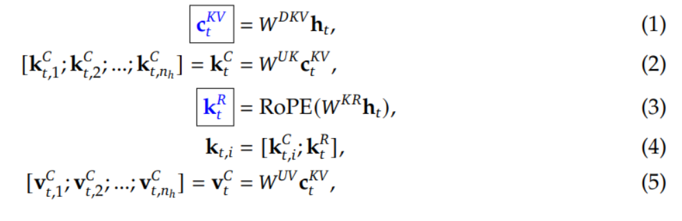
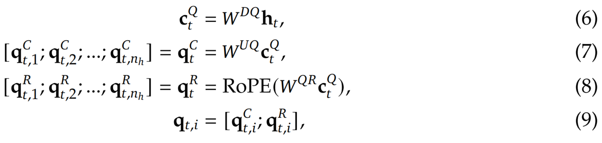

# DeepSeek-v3-From-Scratch
Implemented the DeepSeek v3 model from scratch which includes Multi-Head Latent Attention and MoE architecture

## Multi-Head Latent Attention
**Concept**: Apply low-rank decomposition to the W_kv matrix, (let W_kv = A @ B), use a 
a common latent space for all heads (that is, A is common for all heads, whereas B is 
different for each head). 

Another way to think about it is you are downprojecting X into a latent-space which has
enough information to create the KV projections, without containing unnecessary extra information.

**Equations / Flow**:
1. Down-project inputs L_kv = x.W_dkv
2. Up-project keys K_c = L_kv.W_uk (Let's call this K_c for constant)
3. Project inputs into another rotation-friendly key space and then apply RoPE: K_r = RoPE(W_kr.x)
4. Final keys = concat(K_c, K_r)
5. Finally, get values by up=projecting: V = L_kv.W_uv

**Note** that the down-projection is only used for non-rope (NoPE) part of the Keys. Further, 
the rotation part is concatenated instead of simply rotating the original inputs. Finally,
input is projected into a rotation-friendly key space which is completely separate from
the latent space.

